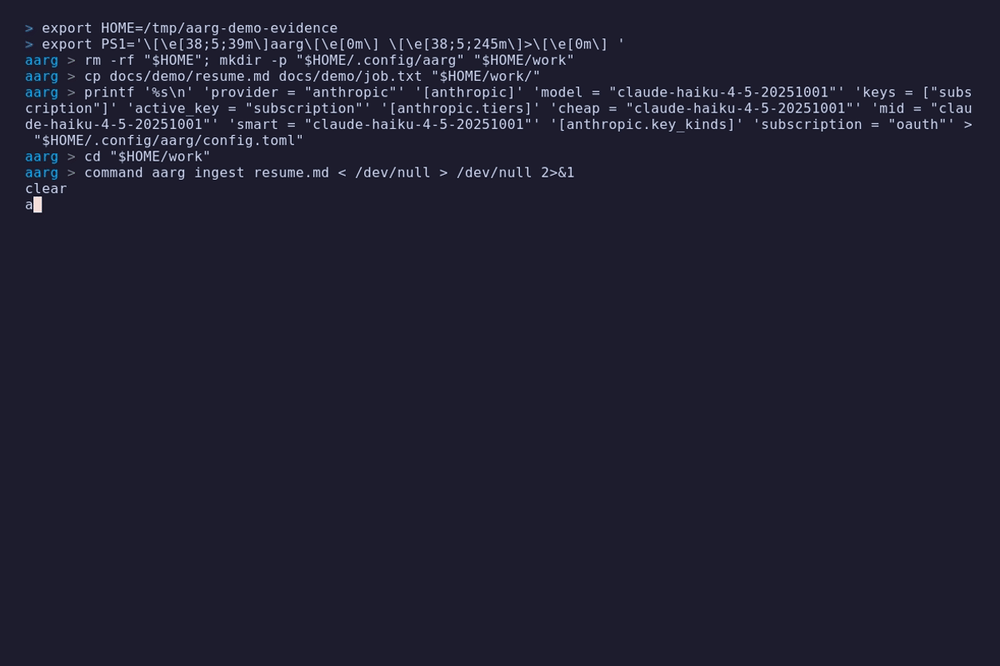
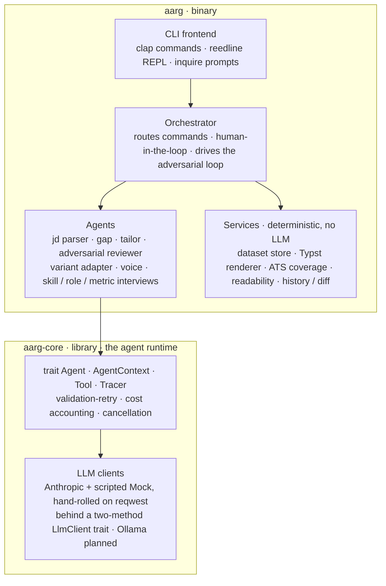

# AARG: The Adversarial Agentic Resume Generator

AARG tailors your résumé to a specific job posting and then argues with itself
about the result. A skeptical reviewer agent reads each draft the way a hiring
manager looking for reasons to pass would, files specific objections, and a
tailoring agent revises against them under tight bounds, keeping the best draft
it finds rather than the last. The output is two PDFs built with
[Typst](https://typst.app): a plain, parser-safe one to upload, and a designed
one to hand a person.

It runs on your machine, against your own career data, and it will not invent
experience you don't have. That last part is the whole point, and it's enforced
in three places rather than promised in one.

> **Status:** working end to end. Ingest, tailoring, the adversarial loop, both
> résumé variants, history/diff, and an interactive shell all work today.
> Anthropic is the supported model provider; a fully-local one is on the
> roadmap, not in the box yet.

## Demo

<p align="center">
  
</p>

A full run on a fictional candidate and posting: ingest a résumé into a
structured dataset, then `tailor` parses the job, analyzes the gap, drafts, and
works the review-and-revise loop, keeping the best draft rather than the last,
before rendering both PDFs and exporting them under friendly names.

## The loop, briefly

1. `ingest` turns an existing résumé into a structured **dataset**: roles,
   bullets, and skills, each tied to evidence.
2. `tailor <job>` parses the posting, runs a **gap analysis** against your
   dataset, and writes a first draft that mirrors the posting's language without
   overstating what you've actually done.
3. The **adversarial reviewer** scores the draft on content and on deterministic
   keyword coverage, then files objections: no metric, vague verb, unsupported
   claim, and so on.
4. The tailoring agent **revises** against those objections and re-scores. A
   revision that doesn't improve the score is discarded and the loop stops; the
   build keeps the best draft it ever saw.
5. The winner renders to an **ATS** PDF and a **human** PDF (same facts,
   different presentation), and every iteration is written to disk so you can
   inspect or diff it later.

When an objection can't be satisfied without lying ("this bullet states an
outcome with no number"), the loop stops guessing and asks you. A short
interview folds your real figures back into the dataset, then re-tailors. The
machine revises what it can revise honestly; you supply the facts it is
forbidden to invent.

The full write-up is in [docs/design/adversarial-loop.md](docs/design/adversarial-loop.md).

## It won't make things up

Every skill, date, employer, and number in the output traces to evidence in your
dataset. This is structural, not a request the model is trusted to honor:

- **At the type level.** A skill with no backing evidence fails validation and
  never reaches a draft.
- **In assembly.** The model speaks in evidence IDs; a number it introduces that
  the source bullet doesn't contain is reverted, and an unbacked skill is
  dropped. The same checks run on the first draft and on every revision, because
  both go through the same code.
- **At review.** The reviewer flags unsupported claims, and a separate lint
  refuses to ship the build if the two PDFs ever diverge on what they claim.

Keyword-coverage gaps, where the posting wants something you didn't surface, are
reported to you and stop there. They never feed back into a prompt, which closes
the obvious backdoor where an ATS miss turns into an invented bullet.

<p align="center">
  
</p>

This is what the rule looks like when it meets a real gap. Adding a skill the
posting wants but your résumé never mentioned isn't a free-text field: AARG makes
you point at a real role and say what you actually did, and that one sentence is
polished into résumé wording, never inflated, before it becomes the evidence. No
evidence, no skill on the page.

## Features

Beyond the core loop:

- **Two résumé variants from one draft.** A plain, parser-safe ATS PDF and a
  designed human PDF, lint-checked to make the same claims. Five templates ship
  built-in, or point `tailor --template` at your own Typst layout.
- **Honest gap-filling.** When the reviewer wants a number, a stronger verb, or a
  skill you didn't surface, AARG interviews you for the real thing instead of
  inventing it, then re-tailors. Thin roles and unbacked keywords work the same
  way.
- **Voice.** Capture a few writing samples and AARG rewrites the AI-sounding lines
  toward how you actually write, without changing any facts.
- **Cover letters.** Drafted from the tailored résumé and the posting, under the
  same never-fabricate guards (`aarg cover`, or `tailor --cover`).
- **History and diff.** Every build is a self-contained folder on disk. List them,
  compare two field by field, re-review an old one (`aarg attack`), or re-render
  it without paying for a new tailor.
- **Flexible input.** Ingest a résumé from text, Markdown, or a PDF, including
  scanned ones read with the model's vision. Give a posting as a file, a
  Greenhouse/Lever URL, stdin, or a paste.
- **Use it from Claude.** Run AARG as an MCP server and drive it by chatting with
  Claude Desktop or Claude Code, on this machine or over SSH, with the copilots as
  in-chat prompts and the PDFs exposed as resources. See [docs/mcp.md](docs/mcp.md).
- **An interactive shell.** Run `aarg` with no arguments for a REPL that takes
  every command without the prefix.

## Getting started

### Prerequisites

- **Rust 1.89 or newer** (2024 edition).
- **[Typst](https://github.com/typst/typst)** on your `PATH`; rendering shells
  out to it. A missing binary fails with install instructions, not a panic.
- An **Anthropic API key**, or a Claude Pro/Max subscription (see
  [Authentication](#authentication)).

### Install

```sh
git clone git@github.com:joseym/aarg.git
cd aarg
cargo install --path .
```

### A first run

```sh
aarg init                  # set up a workspace here, store your key in the OS keychain
aarg ingest resume.pdf     # build your dataset from an existing résumé (text, Markdown, or a text-layer PDF)
aarg tailor job.txt        # parse, gap-analyze, tailor, review, revise, render
```

`tailor` writes `resume.ats.pdf` and `resume.human.pdf` into the build directory
and prints where they landed, the reviewer's verdict, keyword coverage, and what
the run cost. Run `aarg` with no arguments to drop into an interactive shell that
takes the same commands without the prefix.

You don't have to keep job postings in files. `tailor` and `gap` also accept a
Greenhouse/Lever URL or `-` for stdin, and with no argument at all they let you
paste a posting in or reuse one you've already entered.

## Authentication

Keys live in your OS keychain, never in a config file. `aarg init` walks you
through it; `aarg key add|use|remove|list` manages more than one.

```sh
aarg key add work          # an Anthropic API key, filed under a label
aarg key use work
```

You can also authenticate against a Claude **subscription** rather than
pay-as-you-go billing, either by pasting a token from `claude setup-token` or by
delegating to the official `ant` CLI so it refreshes for you. Subscription auth
is **experimental**: Anthropic scopes plan credit to its own tools, so the
API-key path is the supported one. For headless or CI use, set `ANTHROPIC_API_KEY`
(or `ANTHROPIC_AUTH_TOKEN`) and skip the keychain entirely. If those standard
names conflict with another tool, point AARG at private ones with `api_key_env`
/ `auth_token_env` under `[anthropic]` and leave the standard vars free.

## Commands

| | |
|---|---|
| `aarg init` | create a workspace and store a key |
| `aarg ingest <file>` | build your dataset from a résumé (text, Markdown, or a text-layer PDF) |
| `aarg tailor [job]` | the adversarial loop, end to end |
| `aarg chat [job]` | ask about a posting and how your background fits it |
| `aarg gap [job]` | compare a posting against your dataset |
| `aarg jd parse \| rate \| rm` | parse a posting, rate how you fit it, forget remembered ones |
| `aarg dataset show \| validate \| edit` | inspect and correct your data |
| `aarg skills add \| verify \| dedup` | add a skill via an evidence interview, back unverified ones, collapse duplicates |
| `aarg roles enrich [id]` | flesh out thin roles with a short interview |
| `aarg experience add \| list \| remove` | record a project or non-job experience and link the skills it backs |
| `aarg voice add \| list \| remove` | writing samples that steer phrasing |
| `aarg cover [build]` | draft a cover letter for a past build |
| `aarg render [build]` | re-render a build's PDFs without re-tailoring |
| `aarg export [build] [--to <dir>]` | copy a build's PDFs out under friendly company names |
| `aarg attack [build]` | re-review a saved build without re-tailoring |
| `aarg history` / `aarg diff <a> <b>` | list past builds, compare two |
| `aarg templates list \| use <name>` | choose a résumé template |
| `aarg trace last \| show <id>` | inspect recorded agent runs |
| `aarg mcp` | run as an MCP server for Claude Desktop, Claude Code, and other clients ([docs](docs/mcp.md)) |

Two ATS templates (`classic`, `minimal`) and three human ones (`modern`,
`technical`, `editorial`) ship built-in; point `tailor --template <file.typ>` at
your own to render the human variant however you like.

## How it's built

**AARG** is a Rust workspace: an `aarg` binary over an `aarg-core` library. The
library is the agent runtime, and it's the part of this repo most worth reading.



There's no agent framework underneath. The Anthropic client is written directly
against the HTTP API, behind a small trait with a scripted mock, so the whole
thing tests without a network or a key.

### The runtime was extracted, not designed up front

This is the part the commit history is meant to show. Phase 1 shipped three
model-backed features (JD parsing, gap analysis, tailoring) as plain `async`
functions, with their prompt assembly, schema-validated parsing,
retry-on-bad-output, and cost accounting honestly duplicated. By the third, what
they shared was obvious. Phase 2 lifted a single generic `Agent` trait out of
those three working cases in one reviewable diff, and the adversarial loop and
the keyless eval harness then came almost for free, because every agent speaks
one contract. New abstractions arrive when a second consumer does, not in
anticipation of one.

The reasoning behind the trait, and the alternatives weighed against it, is in
[docs/design/agent-runtime.md](docs/design/agent-runtime.md). The convergence
problem the loop solves, and the score-must-improve gate that keeps it from
oscillating, is in [docs/design/adversarial-loop.md](docs/design/adversarial-loop.md).

Determinism stays out of the model wherever it can. ATS keyword coverage and
readability are pure code, not agents, so the facts the score leans on can't be
talked around.

## Roadmap

**Done and working**: the tailor/review/revise loop, both résumé variants with the
claim-divergence lint, gap analysis, the skills/roles/metric interviews, voice
rewriting, cover-letter generation (`aarg cover` or `tailor --cover`), history and
diff, templates, résumé ingestion from text-layer PDFs, an interactive Q&A about a
posting (`aarg chat`), exporting finished PDFs under friendly company names
(`aarg export`), the REPL, experimental subscription auth, and an MCP server
(`aarg mcp`) that lets Claude Desktop and other MCP clients drive AARG by chat,
on the same machine or over SSH, with the copilots as in-chat prompts and the
PDFs exposed as resources ([docs/mcp.md](docs/mcp.md)).

**Not there yet**: a fully-local model provider (the client trait and
per-agent model tiers are already in place for it to slot into), and an
experimental vision pass that reads the rendered layout the way a recruiter
skims it.

## Documentation

- **[Use AARG from Claude (MCP)](docs/mcp.md):** run AARG as an MCP server for
  Claude Desktop or Claude Code, locally or over SSH, and drive it by chat.
- **[The agent runtime](docs/design/agent-runtime.md):** why the `Agent` trait
  was extracted from three working features rather than designed up front, and
  the alternatives weighed against it.
- **[The adversarial loop](docs/design/adversarial-loop.md):** the convergence
  problem the review-and-revise loop solves, and the score-must-improve gate that
  keeps it from oscillating.

## License

Dual-licensed under either [Apache 2.0](LICENSE-APACHE) or [MIT](LICENSE-MIT),
at your option.
