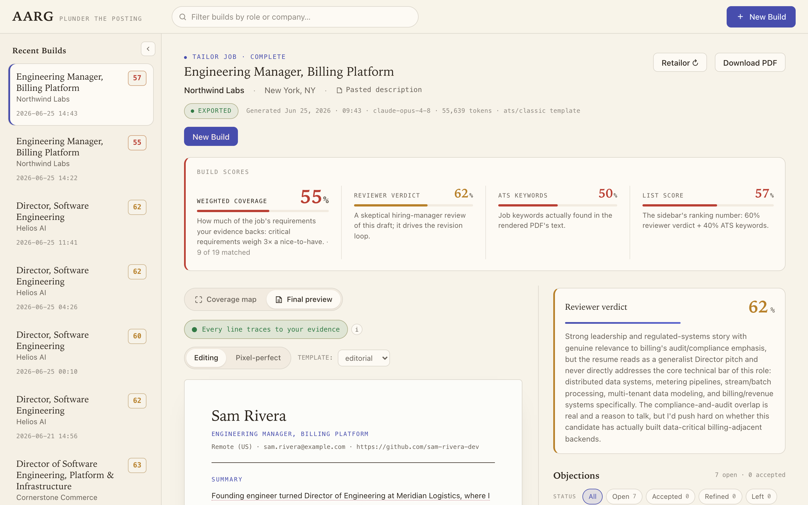
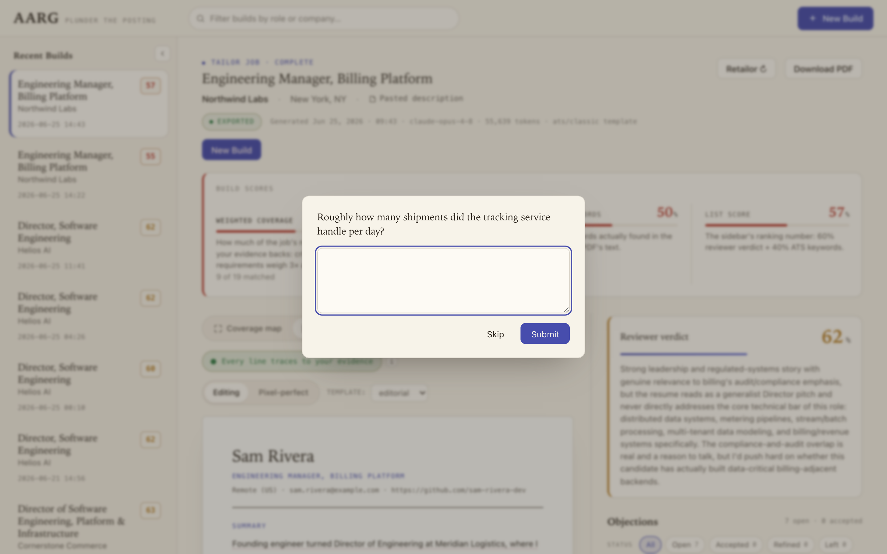
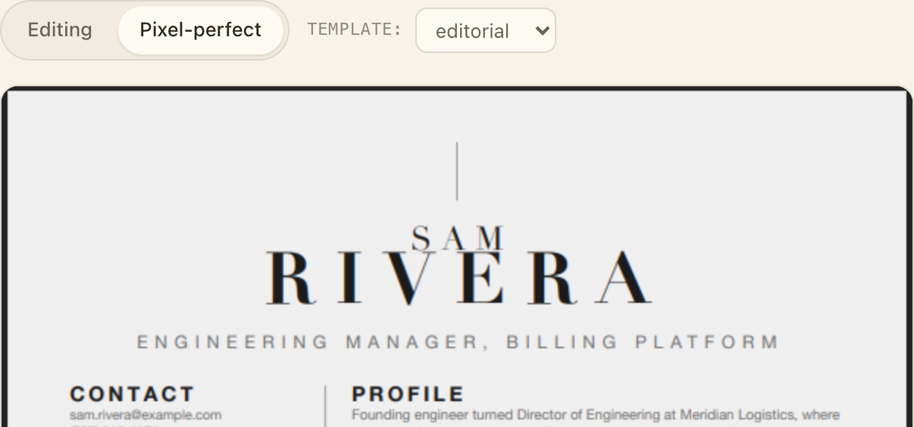
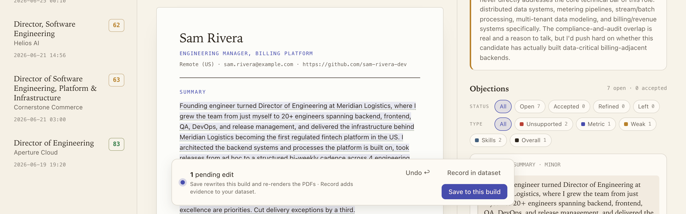
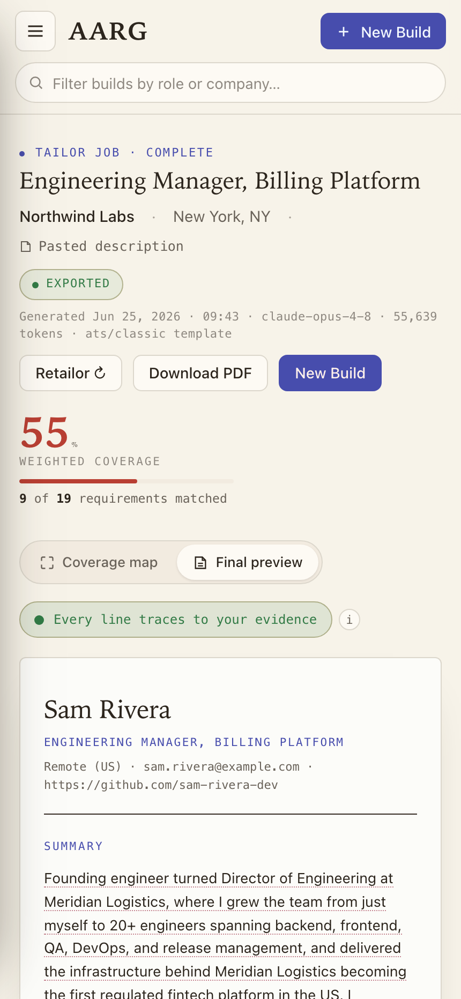
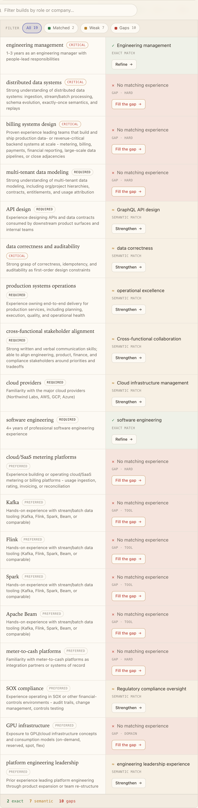
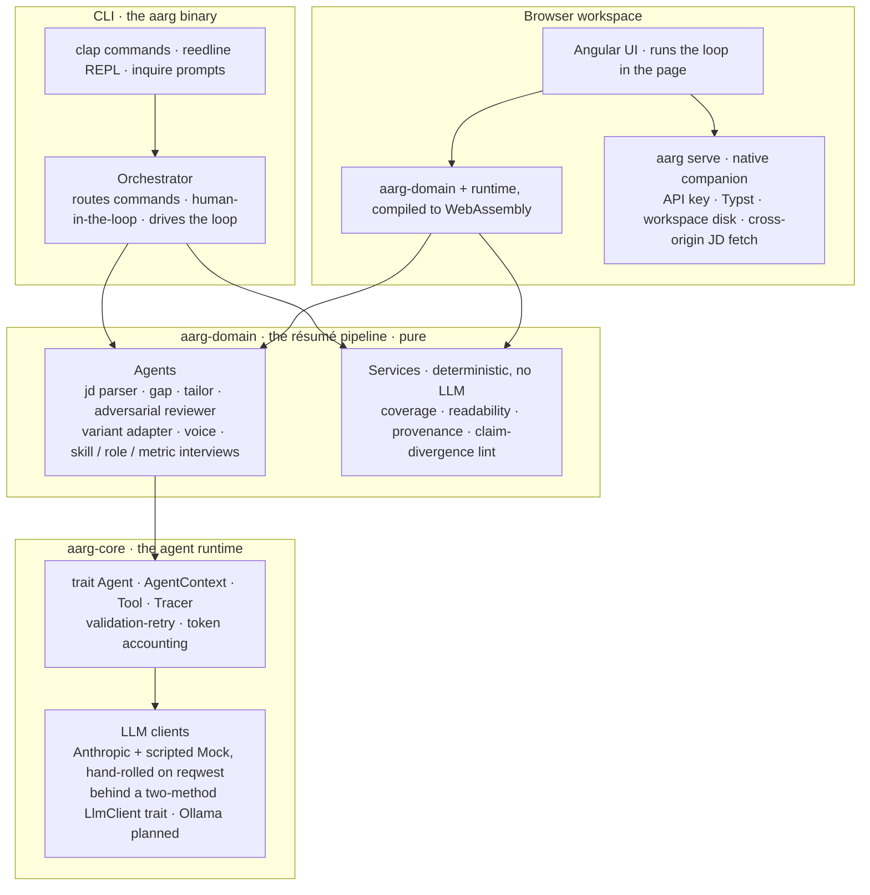

# AARG: The Adversarial Agentic Resume Generator

AARG tailors your résumé to a specific job posting and then argues with itself
about the result. A skeptical reviewer agent reads each draft the way a hiring
manager looking for reasons to pass would, files specific objections, and a
tailoring agent revises against them under tight bounds. The winner renders
with [Typst](https://typst.app) into two PDFs, one formatted to survive
applicant tracking systems and one designed for a person to read.

It runs on your machine, against your own career data, and it will not invent
experience you don't have. Three separate layers enforce that: the validation
types, the assembly step, and the adversarial review.

You can drive it from a command-line tool or from a local browser workspace,
which runs the same Rust in the page via WebAssembly alongside a small
companion server (`aarg serve`).

> **Status:** working end to end, from a command line or a local browser
> workspace. Ingest, tailoring, the adversarial loop, both résumé variants,
> history/diff, an interactive shell, and the in-browser build screen all work
> today. Anthropic is the supported model provider; a fully-local option is
> planned but not built yet.

## Demo

<p align="center">
  
</p>

A full run on a fictional candidate and posting, from `ingest` through the
review loop to the exported PDFs.

## How the loop works

1. `ingest` turns an existing résumé into a structured **dataset**: roles,
   bullets, and skills, each tied to evidence.
2. `tailor <job>` parses the posting, runs a **gap analysis** against your
   dataset, and writes a first draft that mirrors the posting's language without
   overstating what you've actually done.
3. The **adversarial reviewer** scores the draft's content and files
   objections: no metric, vague verb, unsupported claim, and so on. The loop's
   evaluator blends that verdict with deterministic keyword coverage computed
   by pure code.
4. The tailoring agent revises against those objections and re-scores. A
   revision that doesn't improve the score is discarded and the loop stops; the
   build keeps the best draft it ever saw.
5. The winner renders to an **ATS** PDF and a **human** PDF (same facts,
   different presentation), and every iteration is written to disk so you can
   inspect or diff it later.

When an objection can't be satisfied without lying ("this bullet states an
outcome with no number"), the loop stops guessing and asks you. A short
interview folds your real figures back into the dataset, then re-tailors.
Anything factual has to come from you; the model only gets to rephrase it.

The full write-up is in [docs/design/adversarial-loop.md](docs/design/adversarial-loop.md).

## The browser workspace

The same loop, and everything around it, is also a browser app. Run `aarg serve`
and open the page, and you get a single build screen that pulls the pieces
together:

<p align="center">
  
</p>

- **All the scores in one place.** Weighted coverage, the reviewer's verdict,
  ATS keyword coverage, and the list-ranking score sit in one band, each with a
  plain-words explanation of what it measures.
- **A coverage map** of the posting's requirements against your dataset (exact
  match, semantic match, or gap), with a per-requirement **Refine**,
  **Strengthen**, or **Fill the gap** that drops you into the right copilot.
- **An editable, provenance-checked preview.** Every line of the draft is
  free-editable and labelled by where it traces: **verbatim** from a bullet,
  **grounded** in your evidence, or **unrecorded**. An unrecorded line carries a
  claim badge and a confirm-as-evidence button, so you can see exactly which
  lines still need backing before the résumé goes anywhere.
- **Interactive copilots.** The strengthen, metric, summary, and skills
  interviews from the CLI, run through a Q&A modal, plus a layout copilot for
  presentation-only objections. It's the browser mirror of the CLI's
  `UserHandle`: the agent asks the same questions either way.
- **New Build and Retailor**, both running the full adversarial loop *in the
  page* with live iteration, score, and cost, and a **Stop** button that keeps
  the best draft so far. Start from a pasted posting, a URL, or a previous
  build's parsed JD.
- **Pixel-perfect PDF preview** from real Typst renders, with a template picker.
- **Edit persistence:** save your edits into the build behind the same
  claim-divergence guard, with an append-only edit log, history, and revert. A
  sticky pending-edits bar (with `Cmd`/`Ctrl+S`) keeps the save action in reach.

<p align="center">
  
</p>

<p align="center">
  
</p>

<p align="center">
  
</p>

Under the hood, the whole domain pipeline is compiled to WebAssembly and runs
in the page. `aarg serve` is a small native companion for the things a page
can't do itself: proxy one model completion through your keychain-held key,
shell out to Typst, read and write your workspace on disk, and fetch a
cross-origin posting. It binds to loopback by default; opt into `--bind` and
`--allow-host` to reach it from a phone on a network you trust.

The screenshots on this page use a bundled fictional demo dataset (a candidate
named Sam Rivera), so there's no real résumé data in them. The workspace holds up
on a phone, too:

<p align="center">
  
  &nbsp;&nbsp;
  
</p>

## It won't make things up

Every skill, date, employer, and number in the output traces to evidence in your
dataset. The model isn't trusted to follow that rule on its own; three separate
mechanisms hold it:

- **At the type level.** A skill with no backing evidence fails validation and
  never reaches a draft.
- **In assembly.** The model speaks in evidence IDs; a number it introduces that
  the source bullet doesn't contain is reverted, and an unbacked skill is
  dropped. The same checks run on the first draft and on every revision, because
  both go through the same code.
- **At review.** The reviewer flags unsupported claims, and a separate lint
  refuses to ship the build if the two PDFs ever diverge on what they claim.

Keyword-coverage gaps, where the posting wants something you didn't surface, are
reported to you and stop there. They never feed back into a prompt, which closes
the obvious backdoor where an ATS miss turns into an invented bullet.

<p align="center">
  
</p>

Adding a skill the posting wants but your résumé never mentioned means
answering two questions: which real role demonstrates it, and what you actually
did there. Your answer gets tightened into résumé wording and becomes the
backing evidence. If you can't point at a real role, the skill stays off the
page.

The evidence checks and the claim-divergence lint are compiled into the
WebAssembly bundle, so they also run client-side while you edit in the browser.
The server re-checks everything anyway: a draft or edit submitted by a page
(`POST /api/builds`, `POST /api/builds/:id/edits`) goes through the same
deterministic divergence guard before anything is written, a saved dataset is
re-validated the way `aarg dataset validate` would, and a variant that claims
more than the canonical draft is rejected with a `422`. A page could be buggy
or tampered with; the process that owns the disk and the key doesn't rely on
it.

## Features

Beyond the core loop:

- **Two résumé variants from one draft.** A plain, parser-safe ATS PDF and a
  designed human PDF, lint-checked to make the same claims. Five templates ship
  built-in, or point `tailor --template` at your own Typst layout.
- **Gap interviews.** When the reviewer wants a number, a stronger verb, or a
  skill you didn't surface, AARG asks you for the real thing and re-tailors with
  your answer. Thin roles and unbacked keywords work the same way.
- **Voice.** Capture a few writing samples and AARG rewrites the AI-sounding lines
  toward how you actually write, without changing any facts.
- **Cover letters.** Drafted from the tailored résumé and the posting, under the
  same never-fabricate guards (`aarg cover`, or `tailor --cover`).
- **History and diff.** Every build is a self-contained folder on disk. List them,
  compare two field by field, re-review an old one (`aarg attack`), or re-render
  it without paying for a new tailor.
- **Flexible input.** Ingest a résumé from text, Markdown, or a PDF, including
  scanned ones read with the model's vision. Give a posting as a file, a
  Greenhouse/Lever URL, stdin, or a paste.
- **A browser workspace.** The whole build screen, served locally by
  `aarg serve`. See [The browser workspace](#the-browser-workspace).
- **Use it from Claude.** Run AARG as an MCP server and drive it by chatting with
  Claude Desktop or Claude Code, on this machine or over SSH, with the copilots as
  in-chat prompts and the PDFs exposed as resources. See [docs/mcp.md](docs/mcp.md).
- **An interactive shell.** Run `aarg` with no arguments for a REPL that takes
  every command without the prefix.

## Getting started

### Prerequisites

- **Rust 1.89 or newer** (2024 edition).
- **[Typst](https://github.com/typst/typst)** on your `PATH`; rendering shells
  out to it. If the binary is missing you get a clear message telling you how
  to install it.
- An **Anthropic API key**, or a Claude Pro/Max subscription (see
  [Authentication](#authentication)).
- **[wasm-pack](https://rustwasm.github.io/wasm-pack/) and Node.js with npm**,
  only for the browser workspace; they build its WebAssembly bundle and the
  Angular app. Skip them if you only use the CLI.

### Install

```sh
git clone git@github.com:joseym/aarg.git
cd aarg
cargo install --path .
```

### A first run

```sh
aarg init                  # set up a workspace here, store your key in the OS keychain
aarg ingest resume.pdf     # build your dataset from an existing résumé (text, Markdown, or a text-layer PDF)
aarg tailor job.txt        # parse, gap-analyze, tailor, review, revise, render
```

`tailor` writes `resume.ats.pdf` and `resume.human.pdf` into the build directory
and prints where they landed, the reviewer's verdict, keyword coverage, and what
the run cost. Run `aarg` with no arguments to drop into an interactive shell that
takes the same commands without the prefix.

You don't have to keep job postings in files. `tailor` and `gap` also accept a
Greenhouse/Lever URL or `-` for stdin, and with no argument at all they let you
paste a posting in or reuse one you've already entered.

If you'd rather work in a browser: once you have a dataset, `aarg serve --dir web/dist/aarg/browser`
starts the companion server on `http://127.0.0.1:8787`, and everything in
[The browser workspace](#the-browser-workspace) runs from the page, the loop
included. It stays on loopback unless you ask otherwise. Building that app and
reaching it from a phone are covered next in
[Running the browser workspace](#running-the-browser-workspace).

### Running the browser workspace

The browser app is built from source; its WebAssembly bundle and compiled output
are not checked in, so build both once from a fresh clone:

```sh
# Compile the domain pipeline to the WebAssembly bundle the page runs on.
wasm-pack build crates/aarg-wasm --target web --out-dir ../../web/src/wasm/pkg --out-name aarg_wasm

# Install the web app's dependencies (first build only) and compile it.
cd web && npm install && npm run build && cd ..
```

The Angular build lands in `web/dist/aarg/browser`. Point the server at it and
open the URL it prints:

```sh
aarg serve --dir web/dist/aarg/browser   # http://127.0.0.1:8787
```

Flags:

- `--port <PORT>` (default `8787`): the port to bind.
- `--dir <PATH>`: serve the built web app at `/`; omit it to expose the JSON API alone.
- `--bind <ADDR>` (default `127.0.0.1`): loopback only by default; `0.0.0.0` reaches the server from another device on your network.
- `--allow-host <HOST>` (repeatable): extra `Host` header values to accept once bound past loopback; this machine's own hostname is allowed automatically.

To open the workspace from a phone on a network you trust, bind past loopback and
name your host:

```sh
aarg serve --dir web/dist/aarg/browser --bind 0.0.0.0 --allow-host <your-hostname>
```

Then browse to `http://<your-hostname>.local:8787` from the phone. Binding past
loopback also exposes your dataset and the key-spending model proxy to that
network, so use only one you trust. On loopback the `Host` allowlist and a JSON
content-type gate defend the server against DNS-rebinding and drive-by
cross-origin `POST`s, and it sends no CORS headers, so only the page it serves
can talk to it.

`aarg serve` is a long-running process, so a newly installed binary does not take
effect until you stop and restart it. Rebuild the web app the same way after
changing it.

## Authentication

Keys live in your OS keychain, never in a config file. `aarg init` walks you
through it; `aarg key add|use|remove|list` manages more than one.

```sh
aarg key add work          # an Anthropic API key, filed under a label
aarg key use work
```

You can also authenticate against a Claude subscription rather than
pay-as-you-go billing, either by pasting a token from `claude setup-token` or by
delegating to the official `ant` CLI so it refreshes for you. Subscription auth
is **experimental**: Anthropic scopes plan credit to its own tools, so the
API-key path is the supported one. For headless or CI use, set `ANTHROPIC_API_KEY`
(or `ANTHROPIC_AUTH_TOKEN`) and skip the keychain entirely. If those standard
names conflict with another tool, point AARG at private ones with `api_key_env`
/ `auth_token_env` under `[anthropic]` and leave the standard vars free.

## Commands

| | |
|---|---|
| `aarg init` | create a workspace and store a key |
| `aarg ingest <file>` | build your dataset from a résumé (text, Markdown, or a text-layer PDF) |
| `aarg tailor [job]` | the adversarial loop, end to end |
| `aarg chat [job]` | ask about a posting and how your background fits it |
| `aarg gap [job]` | compare a posting against your dataset |
| `aarg jd parse \| rate \| rm` | parse a posting, rate how you fit it, forget remembered ones |
| `aarg dataset show \| validate \| edit` | inspect and correct your data |
| `aarg skills add \| verify \| dedup` | add a skill via an evidence interview, back unverified ones, collapse duplicates |
| `aarg roles enrich [id]` | flesh out thin roles with a short interview |
| `aarg experience add \| list \| remove` | record a project or non-job experience and link the skills it backs |
| `aarg voice add \| list \| remove` | writing samples that steer phrasing |
| `aarg cover [build]` | draft a cover letter for a past build |
| `aarg render [build]` | re-render a build's PDFs without re-tailoring |
| `aarg export [build] [--to <dir>]` | copy a build's PDFs out under friendly company names |
| `aarg attack [build]` | re-review a saved build without re-tailoring |
| `aarg history` / `aarg diff <a> <b>` | list past builds, compare two |
| `aarg templates list \| use <name>` | choose a résumé template |
| `aarg trace last \| show <id>` | inspect recorded agent runs |
| `aarg mcp` | run as an MCP server for Claude Desktop, Claude Code, and other clients ([docs](docs/mcp.md)) |
| `aarg serve` | run the companion server for the browser workspace |

Two ATS templates (`classic`, `minimal`) and three human ones (`modern`,
`technical`, `editorial`) ship built-in; point `tailor --template <file.typ>` at
your own to render the human variant however you like.

`aarg serve` runs the companion server for the browser workspace; its build
steps, flags, and the phone-on-your-network recipe are in
[Running the browser workspace](#running-the-browser-workspace).

## How it's built

**AARG** is a Rust workspace in four crates: `aarg-core` (the agent runtime),
`aarg-domain` (the résumé pipeline, pure code that transforms data and calls out
through the runtime), `aarg-wasm` (a thin wasm-bindgen wrapper that exports the
pipeline to the page), and the `aarg` binary (the CLI, the REPL, the MCP server,
and `serve`). The browser front end is an Angular app, but it doesn't
reimplement any of the pipeline: `aarg-domain` and its runtime compile to
WebAssembly and run in the page, so both front ends sit on the same domain
code.



There's no agent framework underneath, and no web framework either: the Anthropic
client is written directly against the HTTP API behind a small trait with a
scripted mock, and `aarg serve` is written directly against `hyper`, the same
by-hand move as the MCP server, one tokio task per connection, so the whole thing
tests without a network or a key. In the browser, `aarg-core`'s `LlmClient` is
answered by a JS callback across a small `Send`-preserving channel bridge, so the
real domain agents run unchanged over the browser's own model calls.

One difference to know about: the in-browser loop's improve-or-stop gate scores
on the reviewer's verdict alone, while the CLI blends in deterministic ATS
keyword coverage. The agents and drafts are identical; the browser just weighs
a revision slightly differently.

### Where the agent runtime came from

The first three model-backed features (JD parsing, gap analysis, tailoring)
shipped as plain `async` functions, each carrying its own copy of prompt
assembly, schema-validated parsing, retry-on-bad-output, and cost accounting.
By the third, the duplication made the shared shape obvious, so the next phase
lifted a generic `Agent` trait out of the three working cases in one reviewable
diff. The adversarial loop and the keyless eval harness got cheap after that,
since every agent speaks the same contract. I try not to add an abstraction
until the second consumer shows up, and the commit history is there if you want
to check that this one actually happened that way.

The reasoning behind the trait, and the alternatives weighed against it, is in
[docs/design/agent-runtime.md](docs/design/agent-runtime.md). The convergence
problem the loop solves, and the score-must-improve gate that keeps it from
oscillating, is in [docs/design/adversarial-loop.md](docs/design/adversarial-loop.md).

ATS keyword coverage and readability are computed by plain code with no model
in the loop, so the facts the score leans on can't be talked around.

## Roadmap

**Done and working**: the tailor/review/revise loop, both résumé variants with the
claim-divergence lint, gap analysis, the skills/roles/metric interviews, voice
rewriting, cover-letter generation (`aarg cover` or `tailor --cover`), history and
diff, templates, résumé ingestion from text-layer PDFs, an interactive Q&A about a
posting (`aarg chat`), exporting finished PDFs under friendly company names
(`aarg export`), the REPL, experimental subscription auth, an MCP server
(`aarg mcp`) that lets Claude Desktop and other MCP clients drive AARG by chat
([docs/mcp.md](docs/mcp.md)), and the browser workspace (`aarg serve`).

**Not there yet**: a fully-local model provider (the client trait and per-agent
model tiers are already in place for it to slot into); an experimental vision pass
that reads the rendered layout the way a recruiter skims it; streamed (SSE) model
responses in the browser, which today waits for a whole completion; and reaching
the workspace safely past loopback (single-user, local-first is the design for
now; `--bind` past localhost is opt-in and unauthenticated).

## Documentation

- **[Use AARG from Claude (MCP)](docs/mcp.md):** run AARG as an MCP server for
  Claude Desktop or Claude Code, locally or over SSH, and drive it by chat.
- **[The agent runtime](docs/design/agent-runtime.md):** how the `Agent` trait
  grew out of three working features, and the alternatives weighed against it.
- **[The adversarial loop](docs/design/adversarial-loop.md):** the convergence
  problem the review-and-revise loop solves, and the score-must-improve gate that
  keeps it from oscillating.

## License

Dual-licensed under either [Apache 2.0](LICENSE-APACHE) or [MIT](LICENSE-MIT),
at your option.
